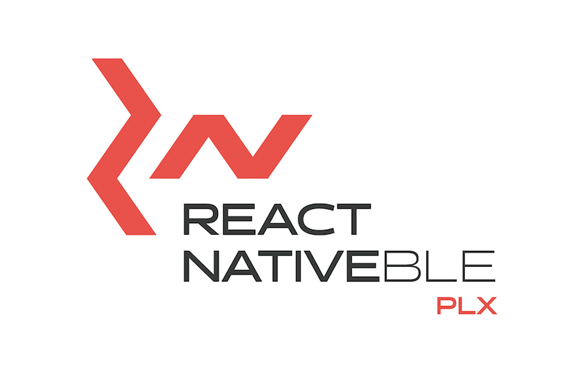

<p align="center">
  
</p>

## About this library

This is React Native Bluetooth Low Energy library wrapping [Multiplatform Ble Adapter](https://github.com/dotintent/MultiPlatformBleAdapter/).

It supports:

- [observing device's Bluetooth adapter state](https://github.com/dotintent/react-native-ble-plx/wiki/Bluetooth-Adapter-State)
- [scanning BLE devices](https://github.com/dotintent/react-native-ble-plx/wiki/Bluetooth-Scanning)
- [making connections to peripherals](https://github.com/dotintent/react-native-ble-plx/wiki/Device-Connecting)
- [discovering services/characteristics](https://github.com/dotintent/react-native-ble-plx/wiki/Device-Service-Discovery)
- [reading](https://github.com/dotintent/react-native-ble-plx/wiki/Characteristic-Reading)/[writing](https://github.com/dotintent/react-native-ble-plx/wiki/Characteristic-Writing) characteristics
- [observing characteristic notifications/indications](https://github.com/dotintent/react-native-ble-plx/wiki/Characteristic-Notifying)
- [reading RSSI](https://github.com/dotintent/react-native-ble-plx/wiki/RSSI-Reading)
- [negotiating MTU](https://github.com/dotintent/react-native-ble-plx/wiki/MTU-Negotiation)
- [background mode on iOS](https://github.com/dotintent/react-native-ble-plx/wiki/Background-mode-(iOS))
- turning the device's Bluetooth adapter on

It does NOT support:

- bluetooth classic devices.
- communicating between phones using BLE (Peripheral support)
- [bonding peripherals](https://github.com/dotintent/react-native-ble-plx/wiki/Device-Bonding)

## Compatibility

This version (2.x) breaks compatibility with old RN versions. Please check [old README](./docs/README_V1.md) (1.x)
for the old instructions or [migration guide](./docs/MIGRATION_V1.md).

| React Native  | 2.0.0                          |
| ------------- | ------------------------------ |
| 0.63.3        | :white_check_mark:             |
| 0.62.2        | :white_check_mark:             |
| 0.61.5        | :white_check_mark:             |
| 0.60.6        | :white_check_mark:             |

## Recent Changes

**2.0.2**
- Updated MultiplatformBleAdapter to version 0.1.7.
- Added support for BleMulator
- Removed destroying of client upon catalystInstanceDestroy.
- Updated CI to RN 0.63.3

[All previous changes](CHANGELOG.md)

## Documentation & Support

Interested in React Native project involving Bluetooth Low Energy? [We can help you!](https://withintent.com/?utm_source=github&utm_medium=github&utm_campaign=external_traffic)

<!-- [Learn more about Polidea's React Native services](https://www.polidea.com/services/react-native/?utm_source=Github&utm_medium=Npaid&utm_campaign=Tech_RN&utm_term=Code&utm_content=GH_NOP_RN_COD_RNB001).

[Learn more about Polidea's BLE services](https://www.polidea.com/services/ble/?utm_source=Github&utm_medium=Npaid&utm_campaign=Tech_BLE&utm_term=Code&utm_content=GH_NOP_BLE_COD_RNB001). -->

[Documentation can be found here](https://dotintent.github.io/react-native-ble-plx/).

[Quick introduction can be found here](https://github.com/dotintent/react-native-ble-plx/blob/master/INTRO.md)

Contact us at [intent](https://withintent.com/contact-us/?utm_source=github&utm_medium=github&utm_campaign=external_traffic).

Contact us at [Gitter](https://gitter.im/RxBLELibraries/react-native-ble) if you have any questions, feedback or want to help!

## Configuration & Installation

### Expo

1. Make sure your Expo project is ejected (formerly: detached). You can read how to do it [here](https://docs.expo.io/versions/latest/expokit/eject/) and [here](https://docs.expo.io/versions/latest/expokit/expokit). (only for expo)
1. Follow steps for iOS/Android.

### iOS ([example setup](https://github.com/Cierpliwy/SensorTag))

1. `npm install --save react-native-ble-plx`
1. Enter `ios` folder and run `pod update`
1. Add `NSBluetoothAlwaysUsageDescription` in `info.plist` file. (it is a requirement since iOS 13)
1. If you want to support background mode:
   - In your application target go to `Capabilities` tab and enable `Uses Bluetooth LE Accessories` in
     `Background Modes` section.
   - Pass `restoreStateIdentifier` and `restoreStateFunction` to `BleManager` constructor.

### Android ([example setup](https://github.com/Cierpliwy/SensorTag))

1. `npm install --save react-native-ble-plx`
1. In top level `build.gradle` make sure that min SDK version is at least 18:

    ```groovy
    buildscript {
        ext {
            ...
            minSdkVersion = 18
            ...
    ```
1. In `build.gradle` make sure to add jitpack repository to known repositories:

    ```groovy
    allprojects {
        repositories {
          ...
          maven { url 'https://www.jitpack.io' }
        }
    }
    ```
1. (Optional) In `AndroidManifest.xml`, add Bluetooth permissions and update `<uses-sdk/>`:

    ```xml
    <manifest xmlns:android="http://schemas.android.com/apk/res/android"
        ...
        <uses-permission android:name="android.permission.BLUETOOTH"/>
        <uses-permission android:name="android.permission.BLUETOOTH_ADMIN"/>
        <uses-permission-sdk-23 android:name="android.permission.ACCESS_FINE_LOCATION"/>

        <!-- Add this line if your application always requires BLE. More info can be found on:
            https://developer.android.com/guide/topics/connectivity/bluetooth-le.html#permissions
          -->
        <uses-feature android:name="android.hardware.bluetooth_le" android:required="true"/>

        ...
    ```

## Troubleshooting

### Problems with Proguard

Add this to your `app/proguard-rules.pro`

```
-dontwarn com.polidea.reactnativeble.**
```
